# PROYECTO DIGITALIZACIÓN

### DESARROLLO DE VIDEOJUEGO CON GODOT

---

### ÍNDICE 

1. Introducción del proyecto 

2. Idea 

 - Expectativas iniciales del desarrollo ( 1º Trimestre )
 
 - Proceso del desarrollo (2º Trimestre )

3. Desarrollo realizado

4. Bibliografía

5. Repositorio De GitHub

---

### **INTRODUCCIÓN**

A lo largo de este curso, he decidido realizar un proyecto basado en la industria del videojuego, este proyecto ha sido escogido y realizado por varias razones, ya que no solamente conlleva una finalidad académica sino más bien personal.

El proyecto llevado a cabo se trata del desarrollo de un videojuego base.

La idea principal es desarrollar y asentar las bases de un videojuego abierto a modificaciones e implementaciones de contenido, en resumen, un proyecto más que nada con un objetivo experimental,  realizando una versión jugable de pruebas con mecánicas, modelados, animaciones y más ( un modelo de Demostración pulido )

En cuanto al videojuego en sí, cuenta  con varias **características**.

* Videojuego realizado en 2 dimensiones (2D)

* Motor empleado: Godot
 
Godot es un motor de videojuegos 2D y 3D multiplataforma, libre y de código abierto, generalmente destaca por la comodidad e intuitivitad a la hora de llevar a cabo proyectos especialmente en 2D por lo que para este proyecto en concreto será de gran utilidad

Debido a mi inexperiencia en cuanto al desarrollo de videojuegos, mi objetivo principal es aprender todo lo posible sobre el cómo trabajar y crear con un motor de videojuegos. 

---

### IDEA

La idea principal del proyecto está centralizada en la creación de un videojuego de plataformas, este tipo de videojuegos contiene varias características.

- Tiene un sistema de movilidad diseñado para interactuar  con obstáculos e interactuables del mapa

- Contiene adversidades y obstáculos en el terreno

--- 

### Expectativas iniciales del desarrollo *( 1º Trimestre )*

La serie de objetivos en torno al proyecto que se desean cumplir en esta primera parte del proyecto llevada durante el 1º trimestre, se centrará en un proceso de aprendizaje haciendo un modelo de pruebas, conlleva la creación de un escenario y aprender sobre diseño de niveles , el manejo herramientas simples para afianzar conceptos como Nodos, Scripts, funcionalidades Básicas y Assets

--- 

##### TRABAJO REALIZADO

Godot es un motor basado en nodos. Estos nodos principales, conocido como ‘**nodos padres**’ se forman por varios nodos más simples "**nodos hijos**” , para hacerse una idea, el personaje seria un nodo principal con varios nodos hijos ( una imagen “nodo de imagen”,  una colisión “nodo de colisión” … ) 

Lo primero de todo a tener en cuenta a la hora de realizar un juego, sería el personaje principal,  el cual manejaremos en el transcurso del juego

Aquí observamos El nodo Personaje compuesto por otros 3 nodos.

- Encontramos el nodo `Sprite2D`, consiste en el PNG del personaje

- Encontramos el nodo `CollisionShape2D`que trata de la colisión del personaje,  la colisión del personaje es visible, sería el cuadrado azul donde se encuentra

- Encontramos el nodo `AnimationPlayer` son de las animaciones del personaje, están formadas por PNGS ( Sprites ) de el personaje en distintas posiciones

Esta sería la primera animación implementada del personaje, el siguiente paso a implementar sería programar en el script .cuando queremos que ocurra esta animación, en este caso, sería al andar

Una vez se ha llevado a cabo la creación del personaje, empezamos a crear las primeras partes del escenario, para ello creamos un nodo con varios nodos hijos de `Sprites`

Aquí podemos observar la creación del escenario con varios nodos.

`Sprites2D` ( son los que contienen un icono de una cara ) estos están interpuestos unos delante de otros para crear un paisaje acorde al juego.

También encontramos varios objetos que de momento no son interactuables, pero en un futuro le daremos un funcionamiento, también encontramos al personaje introducido ya en el escenario, si nos fijamos, este tiene un nodo hijo llamado “ Camera 2D ”

Este nodo hace que la cámara siga en todo momento al Sprite del personaje, esto debe de ser configurado en el Script del nodo Camera 2D

En cuanto al lenguaje de programación que utiliza Godot, se trata de **GDScript**, un lenguaje de programación propio, diseñado para ser fácil de aprender y adaptado al desarrollo de videojuegos. Es similar a C++ en su sintaxis, lo que lo hace intuitivo para quienes ya tienen experiencia en ese lenguaje

En cuanto al nodo `TileMap`, se trata del terreno empleado en el escenario, este cuenta con diversas propiedades que veremos más adelante. Su función principal es la creación de un terreno de una manera más dinámica mediante  bloques de terreno.

--- 

### Proceso del desarrollo *( 2º Trimestre )*

Durante este periodo de trabajo, el objetivo ha sido, seguir el aprendizaje de una manera más profunda y a su vez desarrollando un nuevo proyecto empleando todo lo aprendido durante este periodo de tiempo más el anterior, enfocándonos más en la jugabilidad como experiencia

--- 

##### TRABAJO REALIZADO

Para empezar, desarrollaremos un nuevo proyecto en el cual haremos pruebas de movimiento las cuales utilizaremos e implementaremos posteriormente 

###### Personaje ( movimiento y animaciones )

Lo primero, sería volver a crear un personaje con sus nodos 

De una manera mas practica con un nuevo tipo de nodo, `AnimatedSprite2D` creamos varias animaciones que luego configuraremos en el Script del personaje,

La animación 'Idle' no la tenemos en cuenta ya que es una animación vacía que se crea de forma predeterminada

Ahora vendría desarrollar el código para el movimiento del personaje e implementaremos las animaciones,

Tras varios intentos y pruebas llevadas a cabo, acabamos dando con el código definitivo que cumple justamente las funcionalidades queremos, las cuales son:

  - Movimiento base (desplazarse a la izquierda y a la derecha) y funcionalidad de salto

Dentro de la configuración del proyecto , encontramos  la opción “mapa de entrada”, aquí asignaremos cualquier control ( acciones de movimiento y salto ) 

Esto es para que simplemente reconozca las acciones creadas en los Scripts los cuales luego tendremos que programarlos

En nuestro caso, asignamos:

    - move_left ( tecla ‘a’)
    - move_right (tecla ‘d’) 
    - jump ( tecla ‘Space’)

  - Uso correcto de animaciones en cada situación del personaje 

Todo el proceso de la evolución del código del personaje se encuentra Versionado en el Repositorio de Github, ( enlace al final del documento ) 

Script del personaje ( Jugador ) 

En las primeras líneas encontramos declaraciones de variables implementadas en una función principal que engloba todo el comportamiento de nuestro personaje 

Función principal :

Aquí aplicamos la gravedad

Aquí se determina el movimiento horizontal anteriormente creado 

 

Aquí damos valor a la velocidad de movimiento ( x ) y decidimos cuándo queremos que se reproduzcan las animaciones.

 

Finalmente, asignamos el salto, y la animación cuando queremos que se reproduzca, luego implementamos la función `move_and_slide()` que hace que el personaje pueda moverse por las colisiones de las superficies 

Una vez dado por acabada la realización del personaje manejable, realizaremos varias pruebas, así que creamos un escenario de pruebas con varios nodos.
Cabe recalcar la importancia de añadirle la cámara al personaje en cada nuevo escenario 

 

 

Realización de pruebas de movimiento

  

 

Una vez obtenido el resultado esperado, continuaremos creando un nuevo escenario

###### Escenario ( propiedades )

El objetivo de la creación de un nuevo escenario es el de realizar uno más amplio, y en el utilizar propiedades del nodo `TileMap`.
Este trataría de ser el mapa definitivo, abierto a  varias zonas las cuales se puedan modificar

Con unos nuevos assets de terreno y escenario, y con algunos elementos del anterior

 

Estos serian todos los nodos y varios TileMaps y 
Sprites empleados para el escenario. 

Cada uno de estos nodos de escenario tienen un 
número distinto en su nombre, esto se debe a su 
disposición de la cual hablaremos más tarde.

 

Al dirigirnos a la parte de TileSet y a la pestaña de Paint podremos encontrar varias propiedades las cuales podemos asignar a nuestras partes del mapa, así facilita el proceso a la hora de su desarrollo, evitando el tener que poner las propiedades bloque por bloque una por una.

 

 

Las que hemos implementado de momento han sido dos:

- Propiedad de profundidad ( Z index ) 

Aquí observamos que la profundidad base de del TileMap es de 0 
Por aquí es donde se desplazará nuestro personaje.
Todo Sprite o Parte de TileMap que esté por debajo de el 0, el personaje lo pasara por encima, y todo lo que esté por encima del 0, el personaje lo pasara por detrás  

 

Por ejemplo, aquí solo podemos ver una parte del mapa que se encuentra por delante , en la posición 1, todo lo demás tiene posición 0 

- Físicas de los TileSets 

 

Estas se pueden adaptar manualmente a cualquier tipo de terreno de forma sencilla.
Jugando con estas propiedades y con los diferentes assets combinados, la primera versión del escenario principal sería ésta 

 

###### UI ( Recolección de Monedas ) 

Creación de Nodo2D

 

Este Nodo tiene otros varios nodos hijos como:

    - Area2D ( Coin2D )
        - CollisionShape2D
        - Sprite ( CoinGold )
        - AnimationPlayer

La función del nodo `Area2D` es de interactuar mediante su nodo `ColisiónShape2D` 

Solo cuenta con una animación la cual se repite en bucle mientras no interactúa con 

 

En cuanto a su Script, para que esta interacción se lleve a cabo, su colisión emitirá una señal, cuando entre en contacto con cualquier otra colisión, asi el nodo Coin desaparecerá y emitirá la señal 

 

Esta señal emitida, debe de ser recogida por el código de la UI 

El objetivo de la UI es que nos indique la cantidad de monedas recolectadas en el escenario 

 

Esta UI se encuentra como un nodo 
`CanvasLayer` formado por otros nodos 
como Etiquetas y una imagen 

 

El estructuramiento del código como tal es correcta, pero habría que actualizarlo ya que en la última versión de Godot, este no lo reconoce 
así que lo siguiente por retomar será la implementación integral del código 

 

--- 

### Etapa final del desarrollo *( 3º Trimestre )*

Durante esta última etapa de desarrollo, se ha finalizado el proyecto, añadiendo cambios como nuevas mecánicas y obstáculos, junto a una ampliación de escenario, concluyendo con más partes interactuables y jugables.

También se ha abordado el objetivo principal del juego ya que anteriormente solo hemos desarrollado pruebas de movimiento, terreno y cámara. 

Tras haber terminado la anterior etapa de desarrollo, construyendo un contador de monedas, el objetivo principal del juego girará en torno a eso. En el transcurso del juego, tendrás que recoger hasta 5 monedas repartidas por todo el mapa, pasando por distintas zonas enfrentando diversas dificultades, una vez todas las monedas hayan sido recogidas, habrás completado el juego.

También se ha añadido depuración en la mayor parte de los códigos ya que fue útil en el proceso de desarrollo y  así podremos identificar fallos.

---

#### TRABAJO REALIZADO

Durante esta ultima etapa de desarrollo, se han trabajado varios ámbitos del juego, por lo que los cambios y modificaciones realizadas se dividirán en varios puntos :

* UI y Menú
* Modificación del Personaje
* Obstáculos y objetos añadidos
* Musica y sonidos 
* Modificaciones de escenario
---- 
##### UI y Menú

###### UI 

anteriormente, en la anterior parte de desarrollo, nos quedamos Terminando de realizar una UI en la interfaz que se encargaría de mostrarnos los objetos "moneda" recolectados, así que tras realizar varias pruebas, se consiguió terminarlo
para que sea completamente funcional

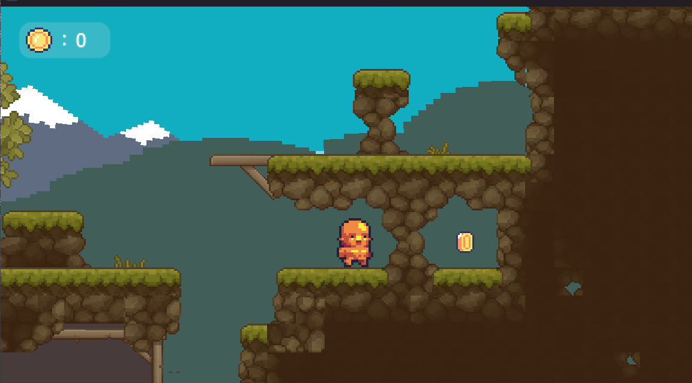
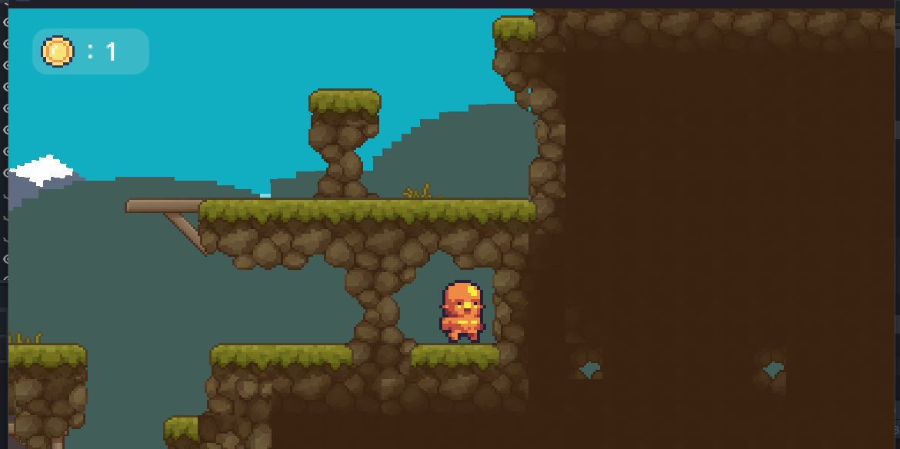

Si nos fijamos en el anterior código, cualquier objeto con físicas, podía interactuar con ella, ya que el `Area2D` no estaba limitada, ahora se ha tenido en cuenta eso y hemos utilizado la función de grupos de Godot, añadiendo nuestro Personaje a el grupo `personaje` y limitando la interactividad de la moneda solo a ese grupo

También junto a la UI, se han añadido varios Corazones en representación de las vidas de nuestro Personaje, este tendrá 3 y cuando se le acaben, se reiniciara la escena completa, teniendo que empezar desde cero el proceso de recolección de monedas 

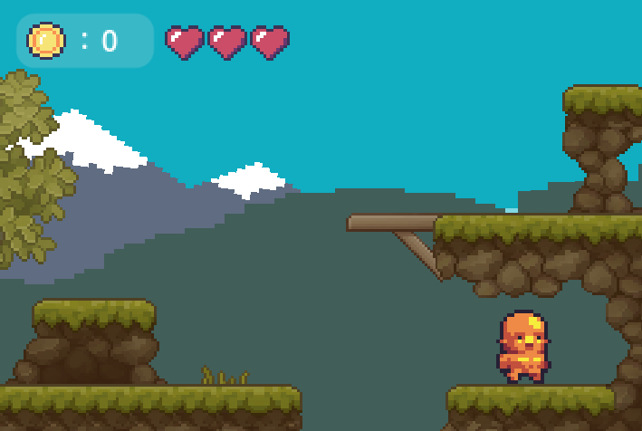

Cada vez que nuestro personaje interactúa con el enemigo, se le reduce un corazón representando la variable de `lifes` creada en el script mediante el método
`_loselife` el cual se llama cada vez que nuestro personaje interactúa con el enemigo o con un obstáculo.

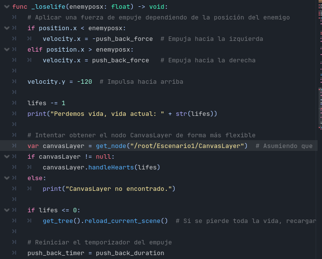

En este método también hay una implementación de la reacción del personaje ya que cuando el método es llamado, una fuerza de repulsión actúa sobre nuestro personaje, echándolo hacia atrás y hacia arriba varios

###### Menú 

Al comenzar nuestro juego, cuenta con un menú de inicio con dos opciones básicas `Start` y `Quit`, se trata de un menú básico pero funcional 

- En `Start` se inicia la escena principal 
- En `Quit` cierras el juego

Este nodo a sido creado con los nodos predeterminados de `User Interface`, y luego se le han añadido un subnodo `VBoxContainer` el cual sirve para ordenar los subnodos como los `Button` uno por debajo del otro,
luego el fondo de el Menú ha sido creado con `Sprites2D` y un `TileMap` para los arboles como ya hemos utilizado anteriormente 

Luego dentro del Juego, se ha añadido también la funcionalidad de un Menú de pausa hecho con otro nodo de `User Interface`.
Lo primero que se hizo fue asignar en el "mapa de entrada" a la tecla 'Escape' la acciòn de pausa, luego en el script del nodo del menú de pausa es configurado. Esto nos permite congelar la escena principal en cualquier momento de la partida.
También tiene implementado un botón que permite volver a el menú principal

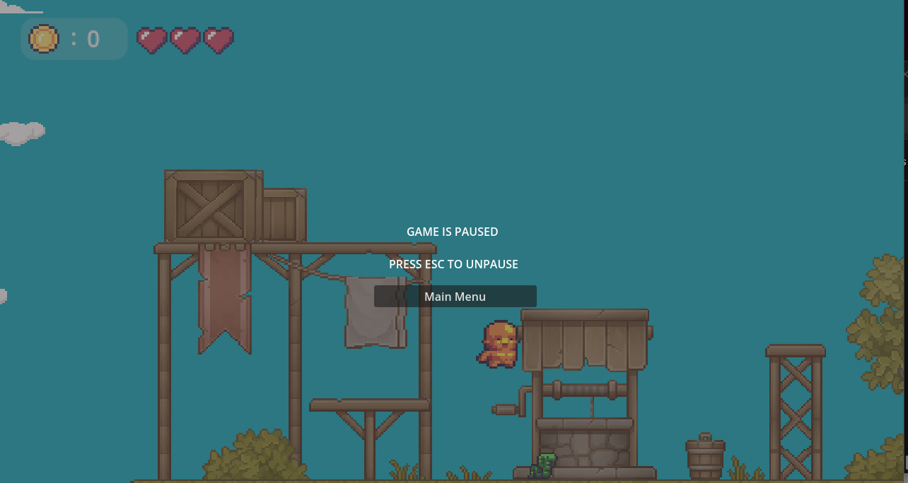

También se le han añadido algunos subnodos como `RichTextLabel` para mostrar las letras y el nodo `ColorRect` para el filtro grisáceo

Luego, empleando los mismos nodos, al recolectar las 5 monedas sale un Menú Final donde se encuentran varios botones

- En `Retry` Se reinicia la escena principal
- En `Main Menu` Vuelve al menú principal

---- 
##### Modificación del personaje 

Como se ha visto anteriormente, se ha añadido tanto vidas como una fuerza de empuje cuando el personaje recibe daño, pero la modificación mas significativa que ha tenido ha sido el añadido de la nueva mecánica de correr.

En el "mapa de entrada" se le ha asignado la tecla 'shift' para que cuando la mantengamos mientras nos movamos, nuestro personaje se mueva un 35% mas rápido, esto también se observa en las animaciones ya que se moverán uniformemente al movimiento del personaje.

Esto influirá en la movilidad haciéndola mas cómoda y divertida 

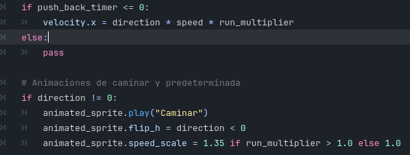

---- 

##### Obstáculos y objetos añadidos

Después de haber ampliado el escenario, hemos añadido algunos obstáculos para que dificulte la obtención de las monedas, entre ellos podemos destacar 4

###### Pinchos

Estos han sido creados con:
    
- `Area2D` que detecta cuando un personaje entra en el área delimitada utilizando una función que viene creada con el nodo, el cual contiene otros 2 nodos :
    - `Tileset` Esto ofrece la imagen y la colisión del objeto
    
    - `CollisionShape2D` Aquí es donde se le da la propiedad a la colisión haciendo que se resetee la escena
   
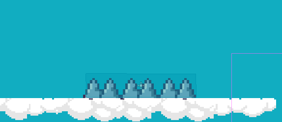

###### Zona de Muerte 

Se trata de un `CollisionShape2D` que se encuentra en algunas zonas del mapa haciendo como limite del mapa y como obstáculo, esta actúa igual que los pinchos pero sin tener colisión propia.
Al caer en esta zona, se volverá a reiniciar la escena 

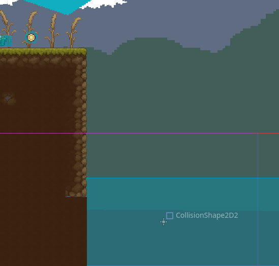

A diferencia de los siguientes obstáculos, estos no llaman a la función mencionada antes `_loselife` sino que hacen directamente que se reinicie la escena( como perder las 3 vides a la vez )

###### Sierra

Este objeto se encuentra en algunas partes del escenario y a diferencia de los dos anteriores, si llama a la función `_loselife`, este aparte contiene varios nodos:

* `Sprite2D` Contiene su imagen
* `Area2D` Detecta al jugador cuando entra en el area delimitada
    * `CollisionPolygon2D` crea una colisión con forma poligonal la cual llamara a la función `_loselife`
* `AnimatedSprite2D` Esto genera en bucle una animación en bucle la cual hace que se mueva la sierra 

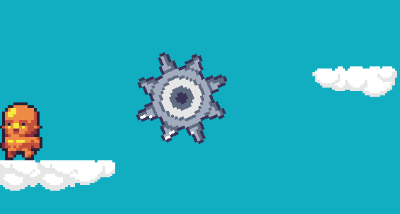

###### Enemigo

Para la creación del enemigo, se ha empleado el nodo del personaje ya que tienen atributos muy parecidos, se le han realizado modificaciones como el cambio de Sprite, cambio de animación, cambio de colisión y se le a quitado algunas líneas de código como las de control de teclas.

La peculiaridad añadida es que se tiene que trabajar con un nuevo nodo llamado `RayCast2D`, este lo que hace es detectar colisiones a lo largo de la linea invisible que marca el nodo

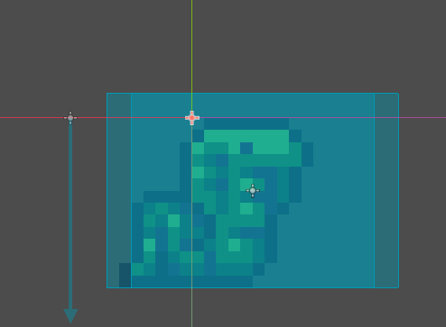

En cuanto a la programación de este nodo, se ha hecho de forma que avance el enemigo y cuando detecte la linea del `RayCast2D` (siempre por delante suya) que no hay colisiones debajo, es decir que no hay suelo, se de la vuelta y camine hacia la otra dirección 

También cuenta con dos colisiones diferentes, la cual una interactúa con las demás colisiones del escenario, y la otra ( dentro de un `Area2D`) para que detecte únicamente la colisión con el jugador, así podrá llamar al método `_loselife`

##### Musica y sonidos

Se ha implementado un sonido cada vez que se recoge una moneda, esto se implementa mediante un nodo `AudioStreamPlayer`, también se le añade un timer para que tarde en desaparecer y asi se pueda emitir el sonido, porque de lo contrario no se emitirá.

Luego, se le ha añadido a la escena principal con el mismo tipo de nodo, una musica de ambientación que se repite en bucle durante prevalezca la escena principal

##### Modificaciones de escenario

Tras haber completado el desarrollo del juego, se ha realizado una ampliación, corrección del escenario y se ha añadido todo lo anterior visto antes

El mapa consta de 4 secciones

###### Sección principal ( donde reaparece el personaje principal)

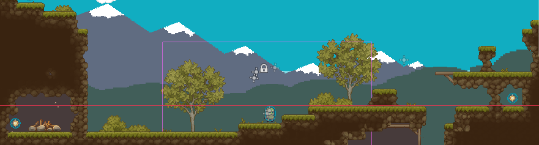

###### Primera Sección 

###### Segunda Sección 

###### Tercera Sección 

El objetivo es Pasar por Todas las secciones recogiendo todas las monedas, el orden no importa

----

#### Últimos detalles 

Tras dar por finalizado el proceso de desarrollo, concluimos con el titulo de nuestro juego, este se llamara **FiveCoins**.
Luego de exportar el proyecto para pasarlo a un ejecutable, Godot nos permite varias formas de exportación. 

Para Comprobar la funcionalidad completa, Godot nos proporciona un ejecutable con la consola para revisar el depuramiento, así estará listo para presentar su funcionamiento integro 

----

### BIBLIOGRAFÍA

Referencias utilizadas en el desarrollo del trabajo:

* [ChatGPT](https://chatgpt.com/.)  Útil para dudas específicas del motor Godot y preguntas concretas sobre la manejabilidad

**Contenido de YouTube**

- [@LuisCanary](https://www.youtube.com/@LuisCanary.) Contiene bastantes videos sobre cursos y desarrollo de videojuegos.

- <https://www.youtube.com/watch?v=F3T_ZhllzJs&t=48s.> Assets Empleados en la descripción del video

Para aprender cómo funciona Godot y fundamentos Básicos

- [Aprende GODOT en 7 minutos (Porque Unity es malvado)](https://www.youtube.com/watch?v=Wa4yO92SXkc&list=LL&index=10&t=217s)

Enlace a Repositorio de GitHub

- <https://github.com/Charlie-24/Proyecto-Godot>
