# PROYECTO DIGITALIZACIÓN

### DESARROLLO DE VIDEOJUEGO CON GODOT

---

### ÍNDICE 

1. Introducción del proyecto 

2. Idea 

 - Expectativas iniciales del desarrollo ( 1º Trimestre )
 
 - Proceso del desarrollo (2º Trimestre )

3. Desarrollo realizado

4. BiblioGrafía

5. Repositorio De GitHub

---

### **INTRODUCCIÓN**

A lo largo de este curso, he decidido realizar un proyecto basado en la industria del videojuego, este proyecto ha sido escogido y realizado por varias razones, ya que no solamente conlleva una finalidad académica sino más bien personal.

El proyecto llevado a cabo se trata del desarrollo de un videojuego base.

La idea principal es desarrollar y asentar las bases de un videojuego abierto a modificaciones e implementaciones de contenido, en resumen, un proyecto más que nada con un objetivo experimental,  realizando una versión jugable de pruebas con mecánicas, modelados, animaciones y más ( un modelo de Demostración pulido )

En cuanto al videojuego en sí, cuenta  con varias **características**.

* Videojuego realizado en 2 dimensiones (2D)

* Motor empleado: Godot
 
Godot es un motor de videojuegos 2D y 3D multiplataforma, libre y de código abierto, generalmente destaca por la comodidad e intuitividad a la hora de llevar a cabo proyectos especialmente en 2D por lo que para este proyecto en concreto será de gran utilidad

Debido a mi inexperiencia en cuanto al desarrollo de videojuegos, mi objetivo principal es aprender todo lo posible sobre el cómo trabajar y crear con un motor de videojuegos. 

---

### IDEA

La idea principal del proyecto está centralizada en la creación de un videojuego de plataformas, este tipo de videojuegos contiene varias características.

- Tiene un sistema de movilidad diseñado para interactuar  con obstáculos e interactuables del mapa

- Contiene adversidades y obstáculos en el terreno

--- 

### Expectativas iniciales del desarrollo *( 1º Trimestre )*

La serie de objetivos en torno al proyecto que se desean cumplir en esta primera parte del proyecto llevada durante el 1º trimestre, se centrará en un proceso de aprendizaje haciendo un modelo de pruebas, conlleva la creación de un escenario y aprender sobre diseño de niveles , el manejo herramientas simples para afianzar conceptos como Nodos, Scripts, funcionalidades Básicas y Assets

--- 

##### TRABAJO REALIZADO

Godot es un motor basado en nodos. Estos nodos principales, conocido como ‘**nodos padres**’ se forman por varios nodos más simples "**nodos hijos**” , para hacerse una idea, el personaje seria un nodo principal con varios nodos hijos ( una imagen “nodo de imagen”,  una colisión “nodo de colisión” … ) 

Lo primero de todo a tener en cuenta a la hora de realizar un juego, sería el personaje principal,  el cual manejaremos en el transcurso del juego

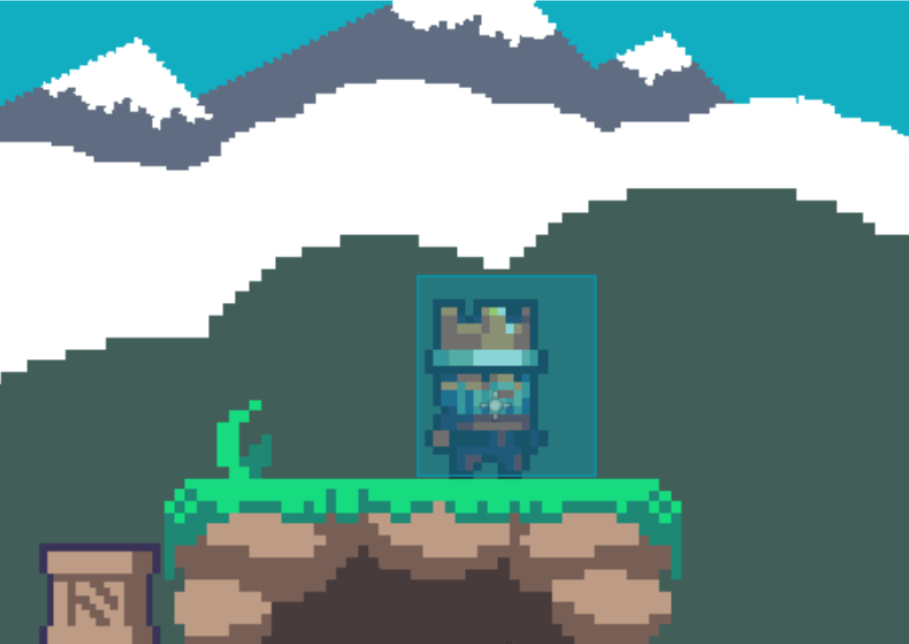

Aquí observamos El nodo Personaje compuesto por otros 3 nodos.

- Encontramos el nodo “*Sprite 2D*”, consiste en el PNG del personaje

- Encontramos el nodo “*CollisionShape2D*”que trata de la colisión del personaje,  la colisión del personaje es visible, sería el cuadrado azul donde se encuentra

- Encontramos el nodo “*AnimationPlayer*” son de las animaciones del personaje, están formadas por PNGS ( Sprites ) de el personaje en distintas posiciones

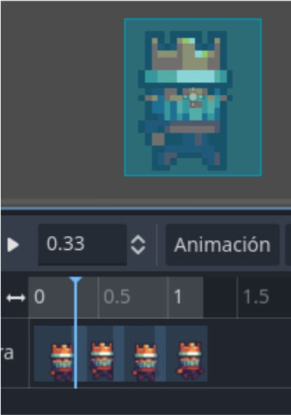
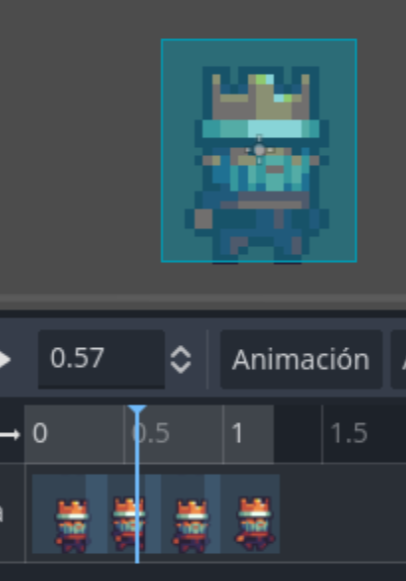

Esta sería la primera animación implementada del personaje, el siguiente paso a implementar sería programar en el script .cuando queremos que ocurra esta animación, en este caso, sería al andar

Una vez se ha llevado a cabo la creación del personaje, empezamos a crear las primeras partes del escenario, para ello creamos un nodo con varios nodos hijos de “Sprites”

Aquí podemos observar la creación del escenario con varios nodos.

“Sprites 2D” ( son los que contienen un icono de una cara ) estos están interpuestos unos delante de otros para crear un paisaje acorde al juego.

También encontramos varios objetos que de momento no son interactuables, pero en un futuro le daremos un funcionamiento, también encontramos al personaje introducido ya en el escenario, si nos fijamos, este tiene un nodo hijo llamado “ Camera 2D ”

Este nodo hace que la cámara siga en todo momento al Sprite del personaje, esto debe de ser configurado en el Script del nodo Camera 2D

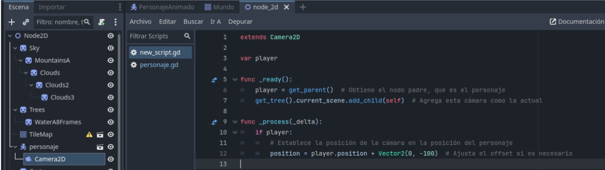

En cuanto al lenguaje de programación que utiliza godot, se trata de **GDScript**, un lenguaje de programación propio, diseñado para ser fácil de aprender y adaptado al desarrollo de videojuegos. Es similar a C++ en su sintaxis, lo que lo hace intuitivo para quienes ya tienen experiencia en ese lenguaje

En cuanto al nodo “*TileMap*”, se trata del terreno empleado en el escenario, este cuenta con diversas propiedades que veremos más adelante. Su función principal es la creación de un terreno de una manera más dinámica mediante  bloques de terreno.

--- 

### Proceso del desarrollo *( 2º Trimestre )*

Durante este periodo de trabajo, el objetivo ha sido, seguir el aprendizaje de una manera más profunda y a su vez desarrollando un nuevo proyecto empleando todo lo aprendido durante este periodo de tiempo más el anterior, enfocándonos más en la jugabilidad como experiencia

--- 

##### TRABAJO REALIZADO

Para empezar, desarrollaremos un nuevo proyecto en el cual haremos pruebas de movimiento las cuales utilizaremos e implementaremos posteriormente 

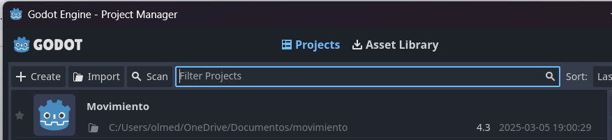

###### Personaje ( movimiento y animaciones )

Lo primero, sería volver a crear un personaje con sus nodos 

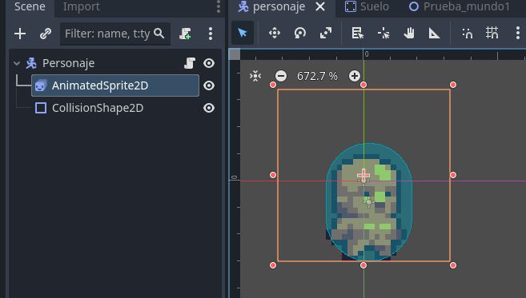

De una manera mas practica con un nuevo tipo de nodo, “*AnimatedSprite2D*” creamos varias animaciones que luego configuraremos en el Script del personaje,

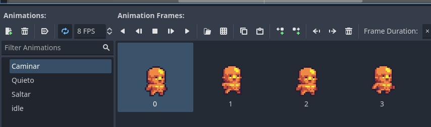

La animación ‘Idle’ no la tenemos en cuenta ya que es una animación vacía que se crea de forma predeterminada

Ahora vendría desarrollar el código para el movimiento del personaje e implementaremos las animaciones,

Tras varios intentos y pruebas llevadas a cabo, acabamos dando con el código definitivo que cumple justamente las funcionalidades queremos, las cuales son:

  - Movimiento base (desplazarse a la izquierda y a la derecha) y funcionalidad de salto

Dentro de la configuración del proyecto , encontramos  la opción “mapa de entrada”, aquí asignaremos cualquier control ( acciones de movimiento y salto ) 

Esto es para que simplemente reconozca las acciones creadas en los Scripts los cuales luego tendremos que programarlos

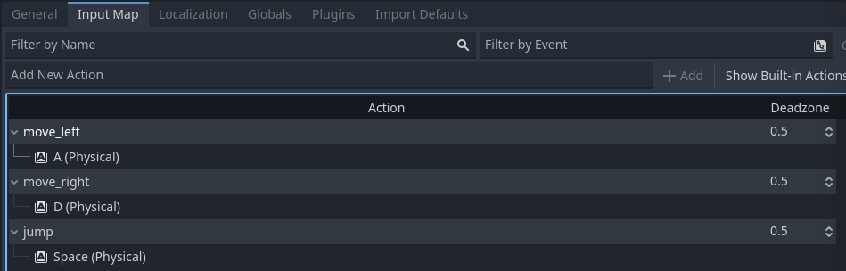

En nuestro caso, asignamos:

    - move_left ( tecla ‘a’)
    - move_right (tecla ‘d’) 
    - jump ( tecla ‘Space’)

  - Uso correcto de animaciones en cada situación del personaje 

Todo el proceso de la evolución del código del personaje se encuentra Versionado en el Repositorio de Github, ( enlace al final del documento ) 

Script del personaje ( Jugador ) 

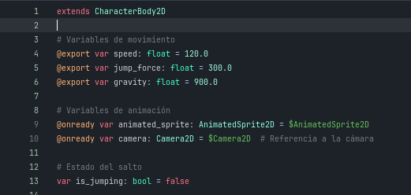

En las primeras líneas encontramos declaraciones de variables implementadas en una función principal que engloba todo el comportamiento de nuestro personaje 

Función principal :

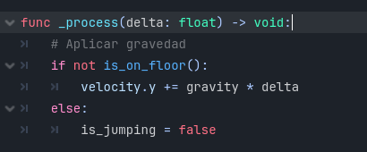

Aquí aplicamos la gravedad

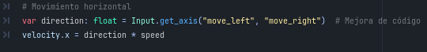

Aquí se determina el movimiento horizontal anteriormente creado 

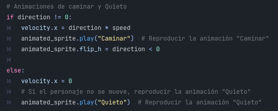 

Aquí damos valor a la velocidad de movimiento ( x ) y decidimos cuándo queremos que se reproduzcan las animaciones.

 

Finalmente, asignamos el salto, y la animación cuando queremos que se reproduzca, luego implementamos la función ‘move_and_slide( )’ que hace que el personaje pueda moverse por las colisiones de las superficies 

Una vez dado por acabada la realización del personaje manejable, realizaremos varias pruebas, así que creamos un escenario de pruebas con varios nodos.
Cabe recalcar la importancia de añadirle la cámara al personaje en cada nuevo escenario 

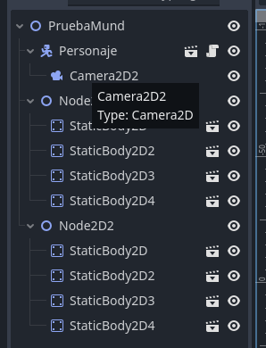 

 

Realización de pruebas de movimiento

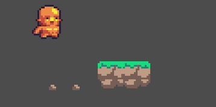

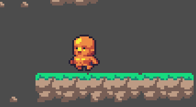  

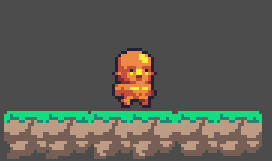 

Una vez obtenido el resultado esperado, continuaremos creando un nuevo escenario

###### Escenario ( propiedades )

El objetivo de la creación de un nuevo escenario es el de realizar uno más amplio, y en el utilizar propiedades del nodo ‘TileMap’.
Este trataria de ser el mapa definitivo, abierto a  varias zonas las cuales se puedan modificar

Con unos nuevos assets de terreno y escenario, y con algunos elementos del anterior

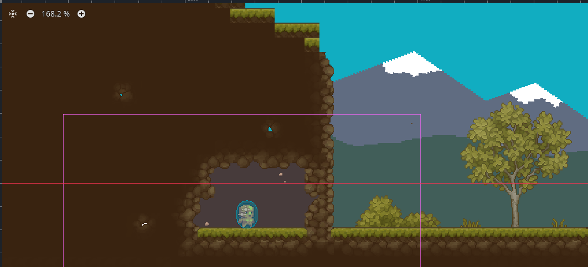 

Estos serian todos los nodos y varios TileMaps y 
Sprites empleados para el escenario. 

Cada uno de estos nodos de escenario tienen un 
número distinto en su nombre, esto se debe a su 
disposición de la cual hablaremos más tarde.

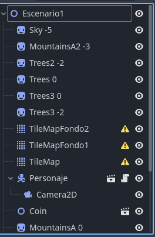 

Al dirigirnos a la parte de TileSet y a la pestaña de Paint podremos encontrar varias propiedades las cuales podemos asignar a nuestras partes del mapa, así facilita el proceso a la hora de su desarrollo, evitando el tener que poner las propiedades bloque por bloque una por una.

 

 

Las que hemos implementado de momento han sido dos:

- Propiedad de profundidad ( Z index ) 

Aquí observamos que la profundidad base de del TileMap es de 0 
Por aquí es donde se desplazará nuestro personaje.
Todo Sprite o Parte de TileMap que esté por debajo de el 0, el personaje lo pasara por encima, y todo lo que esté por encima del 0, el personaje lo pasara por detrás  

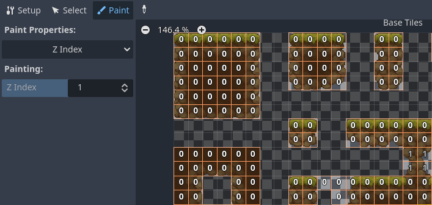 

Por ejemplo, aquí solo podemos ver una parte del mapa que se encuentra por delante , en la posición 1, todo lo demás tiene posición 0 

- Físicas de los TileSets 

 

Estas se pueden adaptar manualmente a cualquier tipo de terreno de forma sencilla.
Jugando con estas propiedades y con los diferentes assets combinados, la primera versión del escenario principal sería ésta 

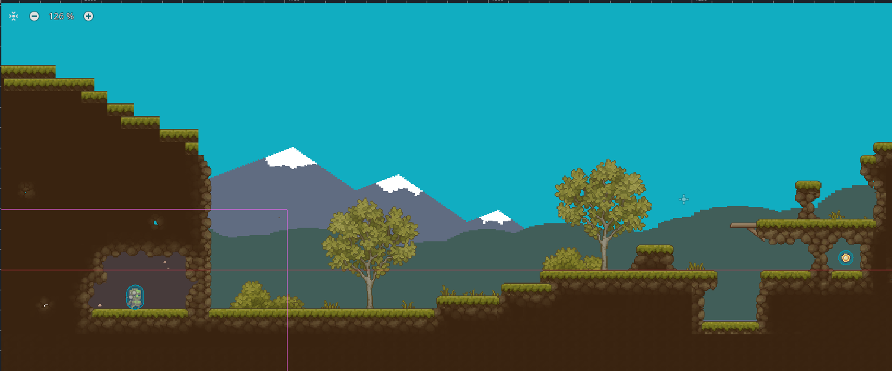 

###### UI ( Recolección de Monedas ) 

Creación de Nodo2D

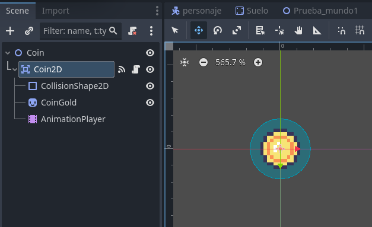 

Este Nodo tiene otros varios nodos hijos como:

    - Area2D ( Coin2D )
        - CollisionShape2D
        - Sprite ( CoinGold )
        - AnimationPlayer

La función del nodo Area 2D es de interactuar mediante su nodo ColisiónShape2D 

Solo cuenta con una animación la cual se repite en bucle mientras no interactúa con 

 

En cuanto a su Script, para que esta interacción se lleve a cabo, su colisión emitirá una señal, cuando entre en contacto con cualquier otra colisión, asi el nodo Coin desaparecerá y emitirá la señal 

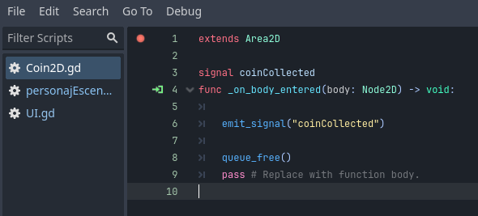 

Esta señal emitida, debe de ser recogida por el código de la UI 

El objetivo de la UI es que nos indique la cantidad de monedas recolectadas en el escenario 

 

Esta UI se encuentra como un nodo 
CanvasLayer formado por otros nodos 
como Etiquetas y una imagen 

 

El estructuramiento del código como tal es correcta, pero habría que actualizarlo ya que en la última versión de godot, este no lo reconoce 
así que lo siguiente por retomar será la implementación integral del código 

 

--- 

### BIBLIOGRAFÍA

Referencias utilizadas en el desarrollo del trabajo:

[ChatGPT](https://chatgpt.com/.)  Útil para dudas específicas del motor Godot y preguntas concretas sobre la manejabilidad

**Contenido de YouTube**

[@LuisCanary](https://www.youtube.com/@LuisCanary.) Contiene bastantes videos sobre cursos y desarrollo de videojuegos.

<https://www.youtube.com/watch?v=F3T_ZhllzJs&t=48s.> Assets Empleados en la descripcion del video

Para aprender cómo funciona Godot y fundamentos Básicos

[Aprende GODOT en 7 minutos (Porque Unity es malvado)](https://www.youtube.com/watch?v=Wa4yO92SXkc&list=LL&index=10&t=217s)

Enlace a Repositorio de GitHub

<https://github.com/Charlie-24/Proyecto-Godot>
	

