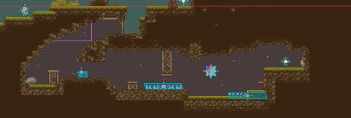
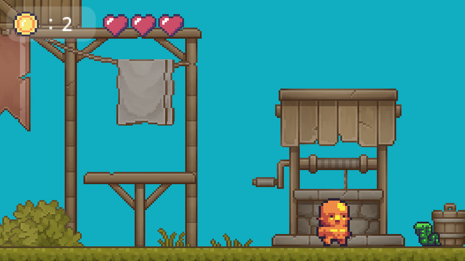

# FiveCoins – Juego de Plataformas 2D 🎮

## Resumen

**FiveCoins** es un juego de plataformas en 2D desarrollado con **Godot Engine** como parte de la asignatura Digitalización.  
El objetivo principal del proyecto es **aprender los fundamentos del desarrollo de videojuegos**, incluyendo:  

- Arquitectura basada en nodos.  
- Programación en **GDScript**.  
- Diseño y gestión de niveles.  
- Implementación de mecánicas de personaje, animaciones, colisiones y UI.  

El proyecto está diseñado para ser **ampliable y modificable**, sirviendo como base para futuras mejoras y experimentación.

---

---

## Concepto del Juego

**Género:** Plataforma 2D  
**Objetivo:** Recolectar 5 monedas distribuidas en varias zonas evitando obstáculos y enemigos.  
**Mecánicas principales:**  

- Movimiento del jugador: caminar, saltar y correr.  
- Obstáculos: pinchos, sierras, zonas de muerte.  
- Enemigos con IA simple usando `RayCast2D`.  
- Interfaz de usuario mostrando monedas recolectadas y vidas restantes.  
- Menús: Inicio, Pausa y Fin de Juego.  

---

## Fases de Desarrollo

### Fase 1 – Prototipo Inicial 
- Aprendizaje de los conceptos básicos de Godot.  
- Creación de escena de prueba con:  
  - Personaje principal usando nodos (`AnimatedSprite2D`, `CollisionShape2D`, `Camera2D`).  
  - Nivel básico con Sprites y TileMaps.  
- Implementación de primeras animaciones y controles.

### Fase 2 – Desarrollo Intermedio 
- Ampliación de movimientos y animaciones del personaje.  
- Construcción de escenarios de prueba para validar mecánicas.  
- Uso de `TileMap` con propiedades de profundidad (`Z index`) y físicas.  
- Implementación de UI inicial para la recolección de monedas.  
- Controles del jugador:  
  - `move_left` → `A`  
  - `move_right` → `D`  
  - `jump` → `Space`  

### Fase 3 – Desarrollo Final 
- Finalización del juego principal **FiveCoins**.  
- Nuevas mecánicas:  
  - Correr con `Shift`.  
  - Gestión de vidas y retroceso al recibir daño.  
- Escenarios ampliados en **cuatro secciones**.  
- Obstáculos interactivos: pinchos, sierras, zonas de muerte y enemigos.  
- Implementación de sonido: efectos de recolección y música ambiental.  
- UI completa: HUD, menús y contador de monedas.  
- Depuración y pulido final del juego.  

---

## Capturas del Juego

**Estructura del nodo Player:**  
  

**Diseño de nivel con TileMap:**  
  

    

**Interfaz de usuario (HUD, monedas y vidas):**  
  

**Menú principal:**  
  

---

## Cómo Jugar

1. Ejecutar el archivo `FiveCoins.exe`.  
2. Controles:  
   - Mover izquierda: `A`  
   - Mover derecha: `D`  
   - Saltar: `Space`  
   - Correr: `Shift`  
   - Pausa: `Esc`  
3. Recolectar las 5 monedas para completar el juego.  
4. Evitar enemigos y obstáculos; perder todas las vidas reinicia la escena.  

---

## Archivos Exportados

- `FiveCoins.exe` → Versión jugable.  
- `FiveCoins.console.exe` → Versión con depuración en consola.  
- `FiveCoins.pck` → Contiene todos los recursos necesarios.  

---

## Recursos y Referencias

- [ChatGPT](https://chatgpt.com/) – Resolución de dudas técnicas sobre Godot.  
- [Assets usados](https://essssam.itch.io/rocky-roads) – Recursos gráficos.  
- [Aprende Godot en 7 minutos](https://www.youtube.com/watch?v=Wa4yO92SXkc&list=LL&index=10&t=217s) – Fundamentos de Godot.  

---

## Repositorio en GitHub

🔗 [Repositorio FiveCoins](https://github.com/Charlie-24/FiveCoins-ProyGodot)

